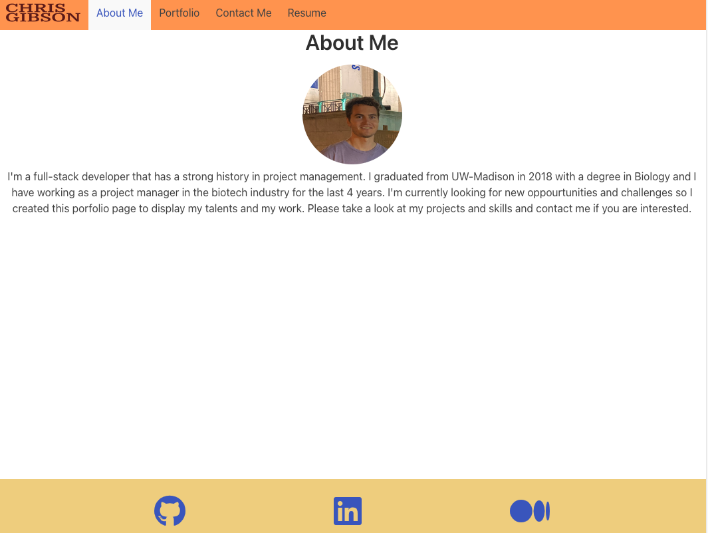

# react-portfolio


## Description

This is my portfolio page built using react...Click on the link below to check it out! It is built using react, email.js, Bulma and react-hook-form among others.

[link to my porfolio on Github pages](https://chrischarlesgibson.github.io/portfolio-react/)

## Table of Contents

- [Description](#Description)
- [Installation](#Installation)
- [Usage](#Usage)
- [Built-With](#Built-With)
- [Author](#Author)
- [Badges](#Badges)
- [License](#License)

## Installation

Here are the dependencies and scripts needed to run this app locally:

```
"dependencies": {
    "@emailjs/browser": "^3.10.0",
    "@fortawesome/fontawesome-svg-core": "^6.2.1",
    "@fortawesome/free-brands-svg-icons": "^6.2.1",
    "@fortawesome/free-solid-svg-icons": "^6.2.1",
    "@fortawesome/react-fontawesome": "^0.2.0",
    "@testing-library/jest-dom": "^5.16.5",
    "@testing-library/react": "^13.4.0",
    "@testing-library/user-event": "^13.5.0",
    "emailjs-com": "^3.2.0",
    "react": "^18.2.0",
    "react-dom": "^18.2.0",
    "react-hook-form": "^7.40.0",
    "react-scripts": "5.0.1",
    "web-vitals": "^2.1.4"
  },
  "scripts": {
    "predeploy": "npm run build",
    "deploy": "gh-pages -d build",
    "start": "react-scripts start",
    "build": "react-scripts build",
    "test": "react-scripts test",
    "eject": "react-scripts eject"
  }

```

## Usage

Just click on the github pages link to open the app or if you want to use this app locally, first go to the to root directory, and open an integrated terminal and run "Npm install" and then "npm run start". This will build and open up the react app.



## Built With

- 
- 
- 
- 
- 
- 

## Author

**Chris Gibson**

- [Link to Chris's Portfolio Site](https://chrischarlesgibson.github.io/Chris-Gibson-project-portfolio/)
- [Link to Chris's Github](https://github.com/chrischarlesgibson)
- [Link to Chris's LinkedIn](https://www.linkedin.com/in/chris-gibson-415909250/)

## Badges


## License

Licensed under the MIT license.[License details here](https://opensource.org/licenses/MIT)
